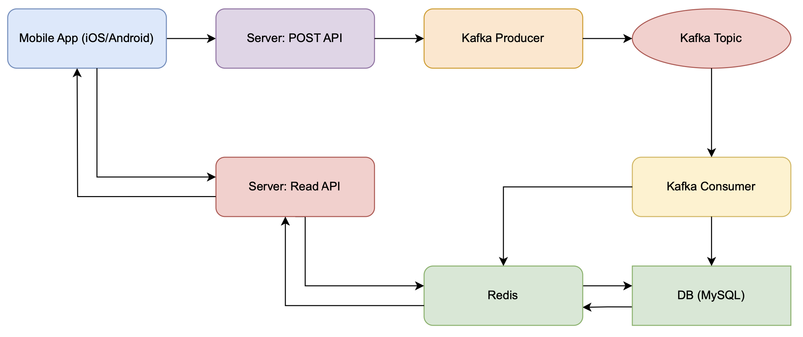
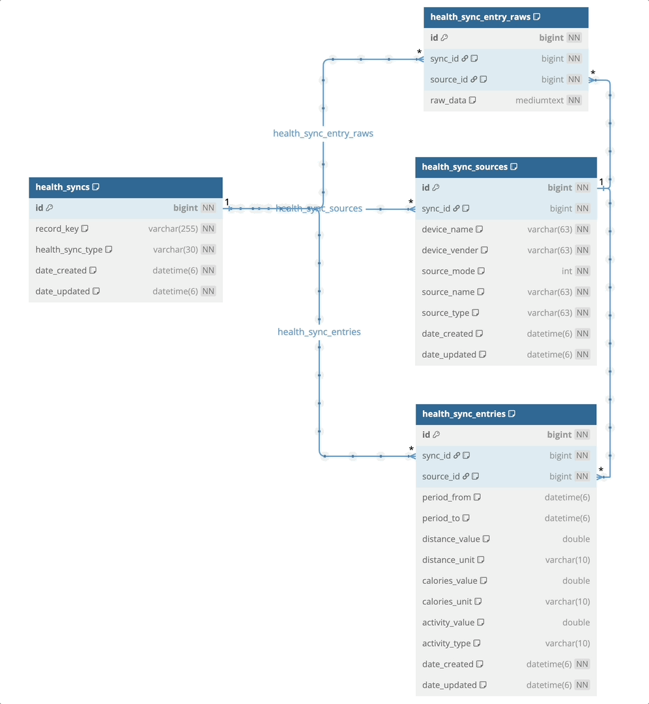

# 헬스 정보 동기화 서비스

---

# 사용 기술

- Java 17
- Spring Boot 3.4.3
- MySQL 8.3
- Kafka
- Redis (구현부 없음)

# 구현 목적

- 아이폰, 갤럭시 건강앱에서 수집한 사용자 헬스 정보를 서버에 동기화하는 서비스를 구현한다.

# 접근 방법

1. 사용자 헬스 정보를 수집하는 앱에서 수집한 정보를 서버로 전송한다.

- POST /api/v1/health/sync

```json
{
  "recordkey": "7836887b-b12a-440f-af0f-851546504b13",
  "data": {
    "entries": [
      {
        "period": {
          "from": "2024-12-16 23:40:00",
          "to": "2024-12-16 23:50:00"
        },
        "distance": {
          "unit": "km",
          "value": 0.06062
        },
        "calories": {
          "unit": "kcal",
          "value": 3.09
        },
        "steps": 81
      }
    ],
    "source": {
      "mode": 9,
      "product": {
        "name": "Android",
        "vender": "Samsung"
      },
      "name": "SamsungHealth",
      "type": ""
    }
  },
  "lastUpdate": "2024-12-16 14:40:00 +0000",
  "type": "steps"
}
```

2. recordkey는 사용자 식별자, source는 앱 식별자 정보로 저장한다.

- recordkey에 여러 source 정보가 들어올수있다는 가정 (동일한 유저가 여러 디바이스를 갖고 있을 수 있기에)
- recordkey : source = 1 : N

3. recordkey, source 정보를 저장한 후 PK와 함께 저장할 Entry 데이터를 저장한다.

- 전달되는 Entry 데이터는 수천건 이므로 Kafka를 통해 비동기로 처리한다.
- 카프카 메시지 발행 시 적절한 메시지 패킷 크기를 고려하여 메시지를 분할하여 전송한다.
- 일부 유실을 고려하여 메시지 발송 전 먼저 DB에 원문을 저장한다. (추후 메시지 유실 시 재전송 기능 추가 구현 필요)
    - 누락된 메시지를 특정하여 재발송이 가능하도록 chunk 단위로 전체 개수와 번호를 함께 발행한다.
- 메시지 발행은 비동기로 발송, 컨슈머에서 메시지를 수신하여 DB에 저장한다.

4. 컨슈머에서 메시지를 수신하여 DB에 저장한다.

- 메시지를 수신하여 DB에 저장할 때는 recordkey PK, source PK 정보를 함께 저장한다.
- 레디스 구현 시 동일 레디스 키에 대해 update or evict 처리를 통해 최신 정보를 유지한다.

5. 서비스에서 recordkey를 통해 사용자 헬스 정보를 조회한다.

- 레디스 구현 시 레디스 캐시를 적용한다.

- GET /api/v1/health/daily/{recordKey}
    - 특정 레코드키의 일별 헬스 정보를 조회한다.
- GET /api/v1/health/daily/all
    - 모든 레코드키의 일별 헬스 정보를 조회한다.
- GET /api/v1/health/monthly/all
    - 모든 레코드키의 월별 헬스 정보를 조회한다.

# 아키텍처



# DB 설계


- `[레코드-건강유형]` 쌍을 저장하는 **health_syncs** 테이블
- health_syncs의 PK를 참조하는 `[건강 동기화 출처 정보]`를 저장하는 **health_sync_sources** 테이블
  - health_syncs.id : health_sync_sources.sync_id = 1 : N
- health_syncs의 PK와 health_sync_sources의 PK를 참조하는 `[건강 동기화 데이터 정보]`를 저장하는 **health_sync_entries** 테이블
  - health_syncs.id : health_sync_entries.sync_id = 1 : N
  - health_sync_sources.id : health_sync_entries.source_id = 1 : N
- health_syncs의 PK와 health_sync_sources의 PK를 참조하는 `[건강 동기화 원천 데이터 정보]`를 저장하는 **health_sync_raw_entries** 테이블
  - health_syncs.id : health_sync_raw_entries.sync_id = 1 : N
  - health_sync_sources.id : health_sync_raw_entries.source_id = 1 : N 

## 다이어그램

1. 건강 동기화 유형 정보 테이블

- record_key와 health_sync_type을 쌍으로하는 유니크 키를 갖도록 했다.
- record_key는 사용자 식별자, health_sync_type은 건강 유형을 나타낸다. (걷기, 헬스, 수영 등)

```sql
create table health_syncs
(
    id               bigint       not null auto_increment,
    record_key       varchar(255) not null comment '레코드 키',
    health_sync_type varchar(30)  not null comment '건강 유형 [steps]',
    date_created     datetime(6)  not null comment '생성일시',
    date_updated     datetime(6)  not null comment '수정일시',
    primary key (id),
    unique key uk_record_key_health_sync_type (record_key, health_sync_type)
) engine = innodb
  default charset = utf8mb4
    comment '건강 동기화 유형 정보';
```

2. 건강 동기화 데이터 출처 정보 테이블

- 건강 동기화 유형 PK를 참조하고, 건강 동기화 출처 정보를 저장한다.
- 한명의 유니크한 사용자도 여러 디바이스를 사용할 수 있으므로 record_key와 1:N 관계를 갖도록 했다.

```sql
create table `health_sync_sources`
(
    id            bigint      not null auto_increment,
    sync_id       bigint      not null comment '건강 동기화 유형 PK',
    device_name   varchar(63) not null comment '출처 디바이스 이름',
    device_vender varchar(63) not null comment '출처 디바이스 제조사',
    source_mode   int         not null comment '출처 모드 번호',
    source_name   varchar(63) not null comment '출처명',
    source_type   varchar(63) not null comment '출처 유형',
    date_created  datetime(6) not null comment '생성일시',
    date_updated  datetime(6) not null comment '수정일시',
    primary key (id),
    index idx_sync_id (sync_id)
) engine = innodb
  default charset = utf8mb4
    comment '건강 동기화 데이터 출처 정보';
```

3. 건강 동기화 데이터 정보 테이블

- 건강 동기화 유형 PK와 건강 동기화 출처 PK를 참조하고, 건강 동기화 데이터 정보를 저장한다.
- 즉, **사용자 A의 1번 디바이스로부터의 건강 정보 데이터** 와 같은 구조로 구분되어 저장된다.

```sql
create table `health_sync_entries`
(
    id             bigint      not null auto_increment,
    sync_id        bigint      not null comment '건강 동기화 유형 PK',
    source_id      bigint      not null comment '건강 동기화 출처 PK',
    period_from    datetime(6) null comment '측정 시작 시간',
    period_to      datetime(6) null comment '측정 종료 시간',
    distance_value double      null comment '이동 거리 값',
    distance_unit  varchar(10) null comment '이동 거리 단위 (km)',
    calories_value double      null comment '소모 칼로리 값',
    calories_unit  varchar(10) null comment '칼로리 단위 (kcal)',
    activity_value double      null comment '활동 값',
    activity_type  varchar(10) null comment '활동 유형 (steps)',
    date_created   datetime(6) not null comment '생성일시',
    date_updated   datetime(6) not null comment '수정일시',
    primary key (id),
    index idx_sync_id (sync_id),
    index idx_source_id (source_id),
    index idx_sync_id_source_id (sync_id, source_id)
) engine = innodb
  default charset = utf8mb4
    comment '건강 동기화 데이터 정보';
```

4. 건강 동기화 원천 데이터 정보 테이블
- 카프카 메시지 발행 시 sync_id, source_id, raw_id(PK)를 함께 전달한다.
- 추후 비어있는 raw_id를 찾아 재전송할 수 있도록 한다.

```sql
create table health_sync_entry_raws
(
    id        bigint     not null auto_increment,
    sync_id   bigint     not null comment '동기화 ID',
    source_id bigint     not null comment '출처 ID',
    raw_data  mediumtext not null comment '건강 동기화 entries JSON 데이터',
    primary key (id),
    index idx_record_key_health_sync_type (sync_id, source_id)
) engine = innodb
  default charset = utf8mb4
    comment '건강 동기화 입력 데이터';

```

# 실행 방법

1. MySQL, Redis, Kafka 서버를 실행한다.

```shell
cd ./tools
docker-compose up -d
```

2. Flyway를 통해 DB 마이그레이션을 실행한다.

```shell
./gradlew flywayClean
./gradlew flywayMigrate
./gradlew flywayCleanTestDB
```

3. QueryDSL을 통해 Q클래스를 생성한다.

```shell
./gradlew kaptKotlin
```

4. 단위 테스트를 실행한다.

```shell
./gradlew test
```

5. 서버를 실행한다.

# DB

- URL: `jdbc:mysql://localhost:3306/`
- 데이터베이스명 : `health_sync`, `health_sync_test (테스트 DB)`
- 사용자 : `health_sync`
- 비밀번호 : `health_sync`

# 제출 산출물

### 데이터 조회 결과

### Daily
- 날짜 기준 정렬 후 recordkey 기준 정렬
```json
[
    {
        "recordkey": "3b87c9a4-f983-4168-8f27-85436447bb57",
        "date": "2024-12.16",
        "steps": 6619.0,
        "calories": 230.16997341000007,
        "distance": 5.078729970700003
    },
    {
        "recordkey": "7836887b-b12a-440f-af0f-851546504b13",
        "date": "2024-12.16",
        "steps": 3445.0,
        "calories": 135.94999491000004,
        "distance": 2.6185099127
    },
    {
        "recordkey": "3b87c9a4-f983-4168-8f27-85436447bb57",
        "date": "2024-12.15",
        "steps": 6064.0,
        "calories": 213.91999202000005,
        "distance": 4.644870074
    },
    {
        "recordkey": "7836887b-b12a-440f-af0f-851546504b13",
        "date": "2024-12.15",
        "steps": 7123.0,
        "calories": 285.28998839999997,
        "distance": 5.365889899999999
    },
    {
        "recordkey": "7b012e6e-ba2b-49c7-bc2e-473b7b58e72e",
        "date": "2024-12.15",
        "steps": 4004.6355981676993,
        "calories": 0.0,
        "distance": 3.203708478534159
    },
    {
        "recordkey": "e27ba7ef-8bb2-424c-af1d-877e826b7487",
        "date": "2024-12.15",
        "steps": 787.9999999999999,
        "calories": 0.0,
        "distance": 0.6304000000000001
    },
    {
        "recordkey": "3b87c9a4-f983-4168-8f27-85436447bb57",
        "date": "2024-12.14",
        "steps": 4246.0,
        "calories": 148.74999259,
        "distance": 3.237930021
    },
    {
        "recordkey": "7836887b-b12a-440f-af0f-851546504b13",
        "date": "2024-12.14",
        "steps": 2798.0,
        "calories": 110.05999299999999,
        "distance": 2.1180499195
    },
    {
        "recordkey": "7b012e6e-ba2b-49c7-bc2e-473b7b58e72e",
        "date": "2024-12.14",
        "steps": 7114.3644018323,
        "calories": 0.0,
        "distance": 5.69149152146584
    },
    {
        "recordkey": "e27ba7ef-8bb2-424c-af1d-877e826b7487",
        "date": "2024-12.14",
        "steps": 5350.000000000001,
        "calories": 0.0,
        "distance": 4.28
    },
    {
        "recordkey": "3b87c9a4-f983-4168-8f27-85436447bb57",
        "date": "2024-12.13",
        "steps": 7833.0,
        "calories": 263.80998297,
        "distance": 6.0487398975
    },
    {
        "recordkey": "7836887b-b12a-440f-af0f-851546504b13",
        "date": "2024-12.13",
        "steps": 7936.0,
        "calories": 316.65995361999995,
        "distance": 6.0442794906
    },
    {
        "recordkey": "7b012e6e-ba2b-49c7-bc2e-473b7b58e72e",
        "date": "2024-12.13",
        "steps": 7315.025976884821,
        "calories": 0.0,
        "distance": 5.852020781507858
    },
    {
        "recordkey": "e27ba7ef-8bb2-424c-af1d-877e826b7487",
        "date": "2024-12.13",
        "steps": 8338.000000000002,
        "calories": 0.0,
        "distance": 6.6704
    },
    {
        "recordkey": "3b87c9a4-f983-4168-8f27-85436447bb57",
        "date": "2024-12.12",
        "steps": 10992.0,
        "calories": 376.7799516399998,
        "distance": 8.4307898415
    },
    {
        "recordkey": "7836887b-b12a-440f-af0f-851546504b13",
        "date": "2024-12.12",
        "steps": 7517.0,
        "calories": 303.50994937,
        "distance": 5.696889554200001
    },
    {
        "recordkey": "7b012e6e-ba2b-49c7-bc2e-473b7b58e72e",
        "date": "2024-12.12",
        "steps": 8510.0,
        "calories": 0.0,
        "distance": 6.807999999999998
    },
    {
        "recordkey": "e27ba7ef-8bb2-424c-af1d-877e826b7487",
        "date": "2024-12.12",
        "steps": 8803.0,
        "calories": 0.0,
        "distance": 7.0424000000000015
    },
    {
        "recordkey": "3b87c9a4-f983-4168-8f27-85436447bb57",
        "date": "2024-12.11",
        "steps": 10788.0,
        "calories": 361.34997465,
        "distance": 8.35927002604
    },
    {
        "recordkey": "7836887b-b12a-440f-af0f-851546504b13",
        "date": "2024-12.11",
        "steps": 7605.0,
        "calories": 306.6799681400001,
        "distance": 5.707399727999999
    },
    {
        "recordkey": "7b012e6e-ba2b-49c7-bc2e-473b7b58e72e",
        "date": "2024-12.11",
        "steps": 8734.34597979522,
        "calories": 0.0,
        "distance": 6.9874767838361755
    },
    {
        "recordkey": "e27ba7ef-8bb2-424c-af1d-877e826b7487",
        "date": "2024-12.11",
        "steps": 12712.0,
        "calories": 0.0,
        "distance": 10.1696
    },
    {
        "recordkey": "3b87c9a4-f983-4168-8f27-85436447bb57",
        "date": "2024-12.10",
        "steps": 8708.0,
        "calories": 302.93998364999993,
        "distance": 6.7504699484999975
    },
    {
        "recordkey": "7836887b-b12a-440f-af0f-851546504b13",
        "date": "2024-12.10",
        "steps": 6539.0,
        "calories": 264.89997952999994,
        "distance": 4.948130010700001
    },
    {
        "recordkey": "7b012e6e-ba2b-49c7-bc2e-473b7b58e72e",
        "date": "2024-12.10",
        "steps": 8040.999999999999,
        "calories": 0.0,
        "distance": 6.4327999999999985
    },
    {
        "recordkey": "e27ba7ef-8bb2-424c-af1d-877e826b7487",
        "date": "2024-12.10",
        "steps": 12888.0,
        "calories": 0.0,
        "distance": 10.310399999999998
    },
    {
        "recordkey": "3b87c9a4-f983-4168-8f27-85436447bb57",
        "date": "2024-12.9",
        "steps": 6011.0,
        "calories": 200.59999100999997,
        "distance": 4.675550031199999
    },
    {
        "recordkey": "7836887b-b12a-440f-af0f-851546504b13",
        "date": "2024-12.9",
        "steps": 8709.0,
        "calories": 349.9599677300001,
        "distance": 6.640329866400001
    },
    {
        "recordkey": "7b012e6e-ba2b-49c7-bc2e-473b7b58e72e",
        "date": "2024-12.9",
        "steps": 6465.996598523009,
        "calories": 0.0,
        "distance": 5.172797278818409
    },
    {
        "recordkey": "e27ba7ef-8bb2-424c-af1d-877e826b7487",
        "date": "2024-12.9",
        "steps": 10906.0,
        "calories": 0.0,
        "distance": 8.724800000000002
    },
    {
        "recordkey": "3b87c9a4-f983-4168-8f27-85436447bb57",
        "date": "2024-12.8",
        "steps": 6389.0,
        "calories": 214.85998897,
        "distance": 5.017519988899998
    },
    {
        "recordkey": "7836887b-b12a-440f-af0f-851546504b13",
        "date": "2024-12.8",
        "steps": 4545.0,
        "calories": 179.90998335999998,
        "distance": 3.4454798279999994
    },
    {
        "recordkey": "7b012e6e-ba2b-49c7-bc2e-473b7b58e72e",
        "date": "2024-12.8",
        "steps": 5751.6984806741775,
        "calories": 0.0,
        "distance": 4.601358784539342
    },
    {
        "recordkey": "e27ba7ef-8bb2-424c-af1d-877e826b7487",
        "date": "2024-12.8",
        "steps": 11654.000000000002,
        "calories": 0.0,
        "distance": 9.3232
    },
    {
        "recordkey": "3b87c9a4-f983-4168-8f27-85436447bb57",
        "date": "2024-12.7",
        "steps": 5526.0,
        "calories": 236.01999191,
        "distance": 4.808719845699999
    },
    {
        "recordkey": "7836887b-b12a-440f-af0f-851546504b13",
        "date": "2024-12.7",
        "steps": 4492.0,
        "calories": 176.81997966,
        "distance": 3.349059636
    },
    {
        "recordkey": "7b012e6e-ba2b-49c7-bc2e-473b7b58e72e",
        "date": "2024-12.7",
        "steps": 11768.047189019499,
        "calories": 0.0,
        "distance": 9.4144377512156
    },
    {
        "recordkey": "e27ba7ef-8bb2-424c-af1d-877e826b7487",
        "date": "2024-12.7",
        "steps": 10268.999999999998,
        "calories": 0.0,
        "distance": 8.215200000000001
    },
    {
        "recordkey": "3b87c9a4-f983-4168-8f27-85436447bb57",
        "date": "2024-12.6",
        "steps": 10565.0,
        "calories": 352.5599174,
        "distance": 8.126920725400003
    },
    {
        "recordkey": "7836887b-b12a-440f-af0f-851546504b13",
        "date": "2024-12.6",
        "steps": 6493.0,
        "calories": 264.55996917,
        "distance": 4.955019571
    },
    {
        "recordkey": "7b012e6e-ba2b-49c7-bc2e-473b7b58e72e",
        "date": "2024-12.6",
        "steps": 5952.2177402378675,
        "calories": 0.0,
        "distance": 4.761774192190293
    },
    {
        "recordkey": "e27ba7ef-8bb2-424c-af1d-877e826b7487",
        "date": "2024-12.6",
        "steps": 8658.0,
        "calories": 0.0,
        "distance": 6.926400000000002
    },
    {
        "recordkey": "3b87c9a4-f983-4168-8f27-85436447bb57",
        "date": "2024-12.5",
        "steps": 10492.0,
        "calories": 381.8599668,
        "distance": 7.997829952999999
    },
    {
        "recordkey": "7836887b-b12a-440f-af0f-851546504b13",
        "date": "2024-12.5",
        "steps": 13409.0,
        "calories": 535.3399339999999,
        "distance": 10.043109575199999
    },
    {
        "recordkey": "7b012e6e-ba2b-49c7-bc2e-473b7b58e72e",
        "date": "2024-12.5",
        "steps": 7242.000000000002,
        "calories": 0.0,
        "distance": 5.793599999999998
    },
    {
        "recordkey": "e27ba7ef-8bb2-424c-af1d-877e826b7487",
        "date": "2024-12.5",
        "steps": 10798.0,
        "calories": 0.0,
        "distance": 8.638399999999999
    },
    {
        "recordkey": "3b87c9a4-f983-4168-8f27-85436447bb57",
        "date": "2024-12.4",
        "steps": 7343.0,
        "calories": 266.46997892999997,
        "distance": 5.551260080699999
    },
    {
        "recordkey": "7836887b-b12a-440f-af0f-851546504b13",
        "date": "2024-12.4",
        "steps": 10892.0,
        "calories": 439.48997087,
        "distance": 8.2010597138
    },
    {
        "recordkey": "7b012e6e-ba2b-49c7-bc2e-473b7b58e72e",
        "date": "2024-12.4",
        "steps": 8164.893757196191,
        "calories": 0.0,
        "distance": 6.531915005756955
    },
    {
        "recordkey": "e27ba7ef-8bb2-424c-af1d-877e826b7487",
        "date": "2024-12.4",
        "steps": 14754.0,
        "calories": 0.0,
        "distance": 11.803199999999999
    },
    {
        "recordkey": "3b87c9a4-f983-4168-8f27-85436447bb57",
        "date": "2024-12.3",
        "steps": 11557.0,
        "calories": 397.81996647999995,
        "distance": 8.904209992999997
    },
    {
        "recordkey": "7836887b-b12a-440f-af0f-851546504b13",
        "date": "2024-12.3",
        "steps": 9450.0,
        "calories": 375.18998350000004,
        "distance": 7.0830898942000005
    },
    {
        "recordkey": "7b012e6e-ba2b-49c7-bc2e-473b7b58e72e",
        "date": "2024-12.3",
        "steps": 9561.619036562312,
        "calories": 0.0,
        "distance": 7.649295229249848
    },
    {
        "recordkey": "e27ba7ef-8bb2-424c-af1d-877e826b7487",
        "date": "2024-12.3",
        "steps": 6741.0,
        "calories": 0.0,
        "distance": 5.3928
    },
    {
        "recordkey": "3b87c9a4-f983-4168-8f27-85436447bb57",
        "date": "2024-12.2",
        "steps": 8630.0,
        "calories": 314.02996880000006,
        "distance": 6.525279989000003
    },
    {
        "recordkey": "7836887b-b12a-440f-af0f-851546504b13",
        "date": "2024-12.2",
        "steps": 5780.0,
        "calories": 234.16997264999995,
        "distance": 4.4221396662
    },
    {
        "recordkey": "7b012e6e-ba2b-49c7-bc2e-473b7b58e72e",
        "date": "2024-12.2",
        "steps": 5908.301038209788,
        "calories": 0.0,
        "distance": 4.726640830567829
    },
    {
        "recordkey": "e27ba7ef-8bb2-424c-af1d-877e826b7487",
        "date": "2024-12.2",
        "steps": 12055.120539935815,
        "calories": 0.0,
        "distance": 9.644096431948652
    },
    {
        "recordkey": "3b87c9a4-f983-4168-8f27-85436447bb57",
        "date": "2024-12.1",
        "steps": 8681.0,
        "calories": 294.50998114,
        "distance": 6.855410137400001
    },
    {
        "recordkey": "7836887b-b12a-440f-af0f-851546504b13",
        "date": "2024-12.1",
        "steps": 8783.0,
        "calories": 354.5299922,
        "distance": 6.680549808999999
    },
    {
        "recordkey": "7b012e6e-ba2b-49c7-bc2e-473b7b58e72e",
        "date": "2024-12.1",
        "steps": 7442.999999999999,
        "calories": 0.0,
        "distance": 5.9544000000000015
    },
    {
        "recordkey": "e27ba7ef-8bb2-424c-af1d-877e826b7487",
        "date": "2024-12.1",
        "steps": 2136.879460064186,
        "calories": 0.0,
        "distance": 1.7095035680513488
    },
    {
        "recordkey": "3b87c9a4-f983-4168-8f27-85436447bb57",
        "date": "2024-11.30",
        "steps": 3221.0,
        "calories": 111.54999458,
        "distance": 2.443260012200001
    },
    {
        "recordkey": "7836887b-b12a-440f-af0f-851546504b13",
        "date": "2024-11.30",
        "steps": 4262.0,
        "calories": 171.8599832,
        "distance": 3.2126698500000006
    },
    {
        "recordkey": "7b012e6e-ba2b-49c7-bc2e-473b7b58e72e",
        "date": "2024-11.30",
        "steps": 5326.214780435164,
        "calories": 0.0,
        "distance": 4.260971824348133
    },
    {
        "recordkey": "e27ba7ef-8bb2-424c-af1d-877e826b7487",
        "date": "2024-11.30",
        "steps": 12886.0,
        "calories": 0.0,
        "distance": 10.308800000000002
    },
    {
        "recordkey": "3b87c9a4-f983-4168-8f27-85436447bb57",
        "date": "2024-11.29",
        "steps": 6489.0,
        "calories": 223.97998872999995,
        "distance": 4.930170122400001
    },
    {
        "recordkey": "7836887b-b12a-440f-af0f-851546504b13",
        "date": "2024-11.29",
        "steps": 7492.0,
        "calories": 298.83998226999995,
        "distance": 5.628219831699999
    },
    {
        "recordkey": "7b012e6e-ba2b-49c7-bc2e-473b7b58e72e",
        "date": "2024-11.29",
        "steps": 5897.315815519748,
        "calories": 0.0,
        "distance": 4.717852652415798
    },
    {
        "recordkey": "e27ba7ef-8bb2-424c-af1d-877e826b7487",
        "date": "2024-11.29",
        "steps": 8701.0,
        "calories": 0.0,
        "distance": 6.9608
    },
    {
        "recordkey": "3b87c9a4-f983-4168-8f27-85436447bb57",
        "date": "2024-11.28",
        "steps": 10055.0,
        "calories": 353.45997851000016,
        "distance": 7.640460155300001
    },
    {
        "recordkey": "7836887b-b12a-440f-af0f-851546504b13",
        "date": "2024-11.28",
        "steps": 9223.0,
        "calories": 367.14995950000014,
        "distance": 6.921909880000001
    },
    {
        "recordkey": "7b012e6e-ba2b-49c7-bc2e-473b7b58e72e",
        "date": "2024-11.28",
        "steps": 7832.868331045777,
        "calories": 0.0,
        "distance": 6.266294664836622
    },
    {
        "recordkey": "e27ba7ef-8bb2-424c-af1d-877e826b7487",
        "date": "2024-11.28",
        "steps": 7747.000000000001,
        "calories": 0.0,
        "distance": 6.1975999999999996
    },
    {
        "recordkey": "3b87c9a4-f983-4168-8f27-85436447bb57",
        "date": "2024-11.27",
        "steps": 9085.0,
        "calories": 329.4299671699999,
        "distance": 6.885980164999997
    },
    {
        "recordkey": "7836887b-b12a-440f-af0f-851546504b13",
        "date": "2024-11.27",
        "steps": 12115.0,
        "calories": 503.77995195000005,
        "distance": 9.145749525400003
    },
    {
        "recordkey": "7b012e6e-ba2b-49c7-bc2e-473b7b58e72e",
        "date": "2024-11.27",
        "steps": 8815.999999999998,
        "calories": 0.0,
        "distance": 7.0527999999999995
    },
    {
        "recordkey": "e27ba7ef-8bb2-424c-af1d-877e826b7487",
        "date": "2024-11.27",
        "steps": 7337.02356020057,
        "calories": 0.0,
        "distance": 5.8696188481604565
    },
    {
        "recordkey": "3b87c9a4-f983-4168-8f27-85436447bb57",
        "date": "2024-11.26",
        "steps": 8116.0,
        "calories": 294.06993320000004,
        "distance": 6.221320288
    },
    {
        "recordkey": "7836887b-b12a-440f-af0f-851546504b13",
        "date": "2024-11.26",
        "steps": 6600.0,
        "calories": 272.49997859999996,
        "distance": 4.9927198957
    },
    {
        "recordkey": "7b012e6e-ba2b-49c7-bc2e-473b7b58e72e",
        "date": "2024-11.26",
        "steps": 8441.367794767591,
        "calories": 0.0,
        "distance": 6.753094235814072
    },
    {
        "recordkey": "e27ba7ef-8bb2-424c-af1d-877e826b7487",
        "date": "2024-11.26",
        "steps": 7677.9764397994295,
        "calories": 0.0,
        "distance": 6.142381151839543
    },
    {
        "recordkey": "3b87c9a4-f983-4168-8f27-85436447bb57",
        "date": "2024-11.25",
        "steps": 8718.0,
        "calories": 309.50994596,
        "distance": 6.690619972500001
    },
    {
        "recordkey": "7836887b-b12a-440f-af0f-851546504b13",
        "date": "2024-11.25",
        "steps": 6759.0,
        "calories": 273.0499689,
        "distance": 5.148209616799999
    },
    {
        "recordkey": "7b012e6e-ba2b-49c7-bc2e-473b7b58e72e",
        "date": "2024-11.25",
        "steps": 7491.16325231926,
        "calories": 0.0,
        "distance": 5.992930601855408
    },
    {
        "recordkey": "e27ba7ef-8bb2-424c-af1d-877e826b7487",
        "date": "2024-11.25",
        "steps": 12569.0,
        "calories": 0.0,
        "distance": 10.0552
    },
    {
        "recordkey": "3b87c9a4-f983-4168-8f27-85436447bb57",
        "date": "2024-11.24",
        "steps": 10733.0,
        "calories": 394.52995475,
        "distance": 8.301670317499998
    },
    {
        "recordkey": "7836887b-b12a-440f-af0f-851546504b13",
        "date": "2024-11.24",
        "steps": 8177.0,
        "calories": 326.6599730799999,
        "distance": 6.2793997688
    },
    {
        "recordkey": "7b012e6e-ba2b-49c7-bc2e-473b7b58e72e",
        "date": "2024-11.24",
        "steps": 4484.573887480747,
        "calories": 0.0,
        "distance": 3.5876591099845974
    },
    {
        "recordkey": "e27ba7ef-8bb2-424c-af1d-877e826b7487",
        "date": "2024-11.24",
        "steps": 2353.0,
        "calories": 0.0,
        "distance": 1.8824
    },
    {
        "recordkey": "3b87c9a4-f983-4168-8f27-85436447bb57",
        "date": "2024-11.23",
        "steps": 5367.0,
        "calories": 201.72995517999996,
        "distance": 4.183059985
    },
    {
        "recordkey": "7836887b-b12a-440f-af0f-851546504b13",
        "date": "2024-11.23",
        "steps": 5682.0,
        "calories": 224.87998100000002,
        "distance": 4.2642300115000005
    },
    {
        "recordkey": "7b012e6e-ba2b-49c7-bc2e-473b7b58e72e",
        "date": "2024-11.23",
        "steps": 8622.520268911601,
        "calories": 0.0,
        "distance": 6.8980162151292825
    },
    {
        "recordkey": "e27ba7ef-8bb2-424c-af1d-877e826b7487",
        "date": "2024-11.23",
        "steps": 8243.0,
        "calories": 0.0,
        "distance": 6.5944
    },
    {
        "recordkey": "3b87c9a4-f983-4168-8f27-85436447bb57",
        "date": "2024-11.22",
        "steps": 6121.0,
        "calories": 211.51996241,
        "distance": 4.674780525
    },
    {
        "recordkey": "7836887b-b12a-440f-af0f-851546504b13",
        "date": "2024-11.22",
        "steps": 8251.0,
        "calories": 327.7599353,
        "distance": 6.296729031100001
    },
    {
        "recordkey": "7b012e6e-ba2b-49c7-bc2e-473b7b58e72e",
        "date": "2024-11.22",
        "steps": 9901.000000000002,
        "calories": 0.0,
        "distance": 7.9208
    },
    {
        "recordkey": "e27ba7ef-8bb2-424c-af1d-877e826b7487",
        "date": "2024-11.22",
        "steps": 6522.0,
        "calories": 0.0,
        "distance": 5.217600000000001
    },
    {
        "recordkey": "3b87c9a4-f983-4168-8f27-85436447bb57",
        "date": "2024-11.21",
        "steps": 9958.0,
        "calories": 348.34995919999994,
        "distance": 7.5880706693999995
    },
    {
        "recordkey": "7836887b-b12a-440f-af0f-851546504b13",
        "date": "2024-11.21",
        "steps": 7388.0,
        "calories": 296.17996028,
        "distance": 5.5687494712
    },
    {
        "recordkey": "7b012e6e-ba2b-49c7-bc2e-473b7b58e72e",
        "date": "2024-11.21",
        "steps": 7730.000000000002,
        "calories": 0.0,
        "distance": 6.184
    },
    {
        "recordkey": "e27ba7ef-8bb2-424c-af1d-877e826b7487",
        "date": "2024-11.21",
        "steps": 9494.0,
        "calories": 0.0,
        "distance": 7.595200000000002
    },
    {
        "recordkey": "3b87c9a4-f983-4168-8f27-85436447bb57",
        "date": "2024-11.20",
        "steps": 9307.0,
        "calories": 323.02993821999996,
        "distance": 7.1681302253000005
    },
    {
        "recordkey": "7836887b-b12a-440f-af0f-851546504b13",
        "date": "2024-11.20",
        "steps": 7449.0,
        "calories": 295.88996349999996,
        "distance": 5.640709794299999
    },
    {
        "recordkey": "7b012e6e-ba2b-49c7-bc2e-473b7b58e72e",
        "date": "2024-11.20",
        "steps": 6164.000000000001,
        "calories": 0.0,
        "distance": 4.9312
    },
    {
        "recordkey": "e27ba7ef-8bb2-424c-af1d-877e826b7487",
        "date": "2024-11.20",
        "steps": 5379.0,
        "calories": 0.0,
        "distance": 4.303200000000001
    },
    {
        "recordkey": "3b87c9a4-f983-4168-8f27-85436447bb57",
        "date": "2024-11.19",
        "steps": 8713.0,
        "calories": 310.08995249,
        "distance": 6.701600049300001
    },
    {
        "recordkey": "7836887b-b12a-440f-af0f-851546504b13",
        "date": "2024-11.19",
        "steps": 6388.0,
        "calories": 255.77996091999998,
        "distance": 4.8602792627
    },
    {
        "recordkey": "7b012e6e-ba2b-49c7-bc2e-473b7b58e72e",
        "date": "2024-11.19",
        "steps": 7796.352590172098,
        "calories": 0.0,
        "distance": 6.237082072137678
    },
    {
        "recordkey": "e27ba7ef-8bb2-424c-af1d-877e826b7487",
        "date": "2024-11.19",
        "steps": 12225.000000000002,
        "calories": 0.0,
        "distance": 9.780000000000001
    },
    {
        "recordkey": "3b87c9a4-f983-4168-8f27-85436447bb57",
        "date": "2024-11.18",
        "steps": 13138.0,
        "calories": 452.72990065999994,
        "distance": 10.186120208899997
    },
    {
        "recordkey": "7836887b-b12a-440f-af0f-851546504b13",
        "date": "2024-11.18",
        "steps": 7774.0,
        "calories": 309.20998180000004,
        "distance": 5.918939822
    },
    {
        "recordkey": "7b012e6e-ba2b-49c7-bc2e-473b7b58e72e",
        "date": "2024-11.18",
        "steps": 10236.497989637448,
        "calories": 0.0,
        "distance": 8.18919839170996
    },
    {
        "recordkey": "e27ba7ef-8bb2-424c-af1d-877e826b7487",
        "date": "2024-11.18",
        "steps": 13694.0,
        "calories": 0.0,
        "distance": 10.9552
    },
    {
        "recordkey": "3b87c9a4-f983-4168-8f27-85436447bb57",
        "date": "2024-11.17",
        "steps": 7339.0,
        "calories": 265.63997659,
        "distance": 5.6575099907999995
    },
    {
        "recordkey": "7836887b-b12a-440f-af0f-851546504b13",
        "date": "2024-11.17",
        "steps": 9143.0,
        "calories": 359.68995803999996,
        "distance": 6.934759645
    },
    {
        "recordkey": "7b012e6e-ba2b-49c7-bc2e-473b7b58e72e",
        "date": "2024-11.17",
        "steps": 4713.0,
        "calories": 0.0,
        "distance": 3.7704000000000004
    },
    {
        "recordkey": "e27ba7ef-8bb2-424c-af1d-877e826b7487",
        "date": "2024-11.17",
        "steps": 2292.0,
        "calories": 0.0,
        "distance": 1.8336
    },
    {
        "recordkey": "3b87c9a4-f983-4168-8f27-85436447bb57",
        "date": "2024-11.16",
        "steps": 5103.0,
        "calories": 200.46999587,
        "distance": 4.286710290500001
    },
    {
        "recordkey": "7836887b-b12a-440f-af0f-851546504b13",
        "date": "2024-11.16",
        "steps": 8369.0,
        "calories": 329.80996555,
        "distance": 6.246209874399999
    },
    {
        "recordkey": "7b012e6e-ba2b-49c7-bc2e-473b7b58e72e",
        "date": "2024-11.16",
        "steps": 5496.563376212808,
        "calories": 0.0,
        "distance": 4.397250700970247
    },
    {
        "recordkey": "e27ba7ef-8bb2-424c-af1d-877e826b7487",
        "date": "2024-11.16",
        "steps": 9144.000000000002,
        "calories": 0.0,
        "distance": 7.315199999999999
    },
    {
        "recordkey": "3b87c9a4-f983-4168-8f27-85436447bb57",
        "date": "2024-11.15",
        "steps": 6948.0,
        "calories": 251.37994328000005,
        "distance": 5.197550145299998
    },
    {
        "recordkey": "7836887b-b12a-440f-af0f-851546504b13",
        "date": "2024-11.15",
        "steps": 7702.0,
        "calories": 307.5199400699999,
        "distance": 5.7729195538
    },
    {
        "recordkey": "7b012e6e-ba2b-49c7-bc2e-473b7b58e72e",
        "date": "2024-11.15",
        "steps": 6678.913753429321,
        "calories": 0.0,
        "distance": 5.343131002743456
    },
    {
        "recordkey": "e27ba7ef-8bb2-424c-af1d-877e826b7487",
        "date": "2024-11.15",
        "steps": 7902.000000000001,
        "calories": 0.0,
        "distance": 6.321600000000001
    },
    {
        "recordkey": "3b87c9a4-f983-4168-8f27-85436447bb57",
        "date": "2024-11.14",
        "steps": 2641.0,
        "calories": 93.9799911,
        "distance": 2.0456800147
    },
    {
        "recordkey": "7836887b-b12a-440f-af0f-851546504b13",
        "date": "2024-11.14",
        "steps": 2085.0,
        "calories": 84.75999478000001,
        "distance": 1.567039951
    },
    {
        "recordkey": "7b012e6e-ba2b-49c7-bc2e-473b7b58e72e",
        "date": "2024-11.14",
        "steps": 2234.5491481752947,
        "calories": 0.0,
        "distance": 1.7876393185402357
    },
    {
        "recordkey": "e27ba7ef-8bb2-424c-af1d-877e826b7487",
        "date": "2024-11.14",
        "steps": 2079.0,
        "calories": 0.0,
        "distance": 1.6632
    }
]
```

### Monthly
```json
[
  {
    "recordkey": "3b87c9a4-f983-4168-8f27-85436447bb57",
    "date": "2024-12",
    "steps": 130444.0,
    "calories": 4556.44960237,
    "distance": 101.01350052353993
  },
  {
    "recordkey": "7836887b-b12a-440f-af0f-851546504b13",
    "date": "2024-12",
    "steps": 115516.0,
    "calories": 4633.019580110001,
    "distance": 87.31898607549998
  },
  {
    "recordkey": "7b012e6e-ba2b-49c7-bc2e-473b7b58e72e",
    "date": "2024-12",
    "steps": 111977.14579710292,
    "calories": 0.0,
    "distance": 89.58171663768229
  },
  {
    "recordkey": "e27ba7ef-8bb2-424c-af1d-877e826b7487",
    "date": "2024-12",
    "steps": 136850.99999999997,
    "calories": 0.0,
    "distance": 109.48079999999996
  },
  {
    "recordkey": "3b87c9a4-f983-4168-8f27-85436447bb57",
    "date": "2024-11",
    "steps": 131052.0,
    "calories": 4675.449337899996,
    "distance": 100.80269313710004
  },
  {
    "recordkey": "7836887b-b12a-440f-af0f-851546504b13",
    "date": "2024-11",
    "steps": 124859.0,
    "calories": 5005.3194387400035,
    "distance": 94.39944478539987
  },
  {
    "recordkey": "7b012e6e-ba2b-49c7-bc2e-473b7b58e72e",
    "date": "2024-11",
    "steps": 117862.9009881069,
    "calories": 0.0,
    "distance": 94.29032079048542
  },
  {
    "recordkey": "e27ba7ef-8bb2-424c-af1d-877e826b7487",
    "date": "2024-11",
    "steps": 136245.00000000003,
    "calories": 0.0,
    "distance": 108.99600000000002
  }
]
```
